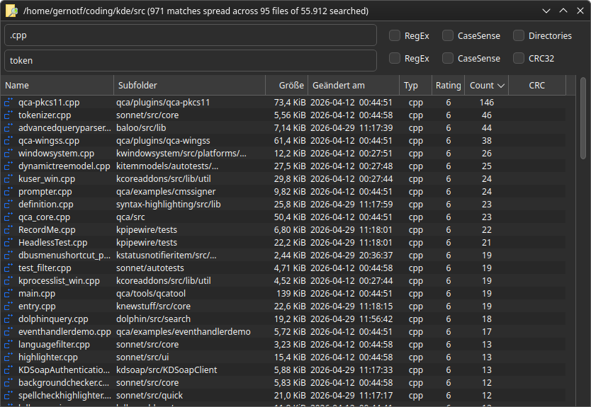

# mkFileSearch

mkFileSearch is a Qt6 based simple and fast file search tool for Linux and Windows that does not rely on any indexing services. It allows for searching by filename and/or content either with regular search terms or RegEx expressions.

Without further arguments given, it defaults to the $HOME folder.
The intended workflow for this app is to open it with `mkFileSearch /path/to/search`, either from a file manager that allows for launching external apps this way, or via hotkey.

For example, to launch it for searching inside the path that the active Dolphin window is dispaying, a script like this could be bound to a hotkey in KDE Plasma:

```
#!/bin/bash

if [ "$XDG_SESSION_TYPE" == "wayland" ]; then
    TOOL="kdotool"
else
    TOOL="xdotool"
fi

WINDOW_ID=$($TOOL getactivewindow)
FULL_TITLE=$($TOOL getwindowname "$WINDOW_ID")
CLEAN_PATH="${FULL_TITLE% — Dolphin}"
if [ -d "$CLEAN_PATH" ]; then
    /path/to/mkFileSearch "$CLEAN_PATH"
fi
```

Note that this needs Dolphin to be set up to show the full path in its title bar.
